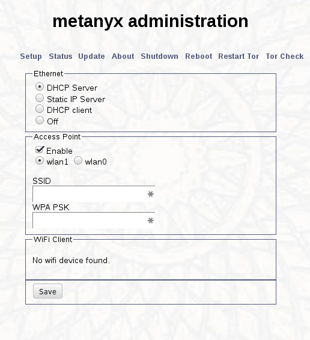

metanyx
========

A transparent [Tor](https://www.torproject.org/) proxy in a little box.

*please, don't trust this with your life, metanyx is still in it's infancy*

About
-----

I've been hacking away at this slowly for a while now, starting with the BeagleBone
Black and now utilising the OlinuXino A20 LIME as my main focus of attention.

Get It
------

You can grab an image for the BeagleBone Black via https://metanyx.net

OlinuXino images are still on their way, I'll put one up once the web interface is good.

Otherwise continue on to configure a Debian ARM system as a metanyx unit

How to build a metanyx
----------------------

All technical steps have been written assuming that the user is using a Debian system. sorrynotsorry

Development is presently focused on the [Olimex A20-OLinuXino-Lime](https://www.olimex.com/Products/OLinuXino/A10/A10-OLinuXino-LIME/open-source-hardware) board.
I hope to support multiple boards, however the most feature rich result will be with the Olimex board

### 1) Setup the hardware

First check the [compatable hardware](#compatable-hardware) section below.

#### Olimex

See [sdimage](sdimage/README.md)

#### BeagleBone Black

In the beginning, I went ahead and removed the serial number sticker from the bone.

The BeagleBoneBlack playbook has been tested against the official BBB Debian firmware, of some version...

 **Flash an SD card with a Debian image**

The latest image can be downloaded from http://beagleboard.org/latest-images

Be sure to verify the md5sum on the image.

    md5sum bone-debian-7.5-2014-05-14-2gb.img.xz

You can flash the image to the BBB from a linux system using dd

    unxz bone-debian-7.5-2014-05-14-2gb.img.xz 
    sudo dd if=bone-debian-7.5-2014-05-14-2gb.img of=/dev/<id>

Once burned, slot that sucker into the bone.

 **Set up networking and SSH to the Beagle Bone**

There are good guides to this already online, such as the BeagleBoard [getting started guide](http://beagleboard.org/Getting+Started)

I use Linux and found the following steps to work:

- Download and run [mkudevrule.sh](http://beagleboard.org/static/Drivers/Linux/FTDI/mkudevrule.sh) from beagleboard.org (*NOTE that presently beagleboard.org is unavailable via SSL - I'm yet to raise this with them*)

- Plug the mini USB cable into the BeagleBone and then into your host system.  
Once powered up you should see a new network interface.

- Configure the new network interface with an ip, such as

    `ifconfig eth1 192.168.7.1`

- You should now be able to ssh to the BeagleBone

    `ssh root@192.168.7.2`

- Expand the filesystem to take up the remaining empty space on your SD card

    `bash /opt/scripts/tools/grow_partition.sh`

- Reboot

### 2) Run the provided ansible playbook
[Instructions](https://github.com/metanyx/metanyx/tree/master/ansible)

### 3) Reboot your new metanyx
Just pull the power from the unit.

Once you've done this, plug the ethernet cable into your computer, and a wireless USB dongle into the units 
USB port.  If you're feeling generous you could use an ethernet switch and share the darkness with your friends 
or neighbours ( although you'll  want to set a root password and will put you at more risk).  
Ensure any other connections to your computer are disabled, such as your local WiFi.

Then you can go ahead and plug it back in, it'll take about a minute to boot and give you an IP address.

You can browse to the metanyx web interface at http://192.168.5.1

### 4) Check that you're properly configured
Visit https://check.torproject.org/ to confirm that you are now surfing via Tor. Cowabunga!

Compatable Hardware
-------------------

### ARM boards presently supported:
- BeagleBone Black revC (likely broken right now sorry, but the image on the site is good)
- Olimex OLinuXino LIME A20

### WiFi devices

The following wireless devices are considered stable when used as part of the metanyx
* Alfa AWUS036NH USB WiFi
* Edimax EW-7811Un

There is also a list of [officially tested BeagleBone Black WiFi devices](http://elinux.org/Beagleboard:BeagleBoneBlack#WIFI_Adapters), any of which I would presume to work if listed to work with Debian.

Known Issues
------------
See [issues](https://github.com/auraltension/metanyx/issues)

Contact
-------
email: auraltension@riseup.net (PGP key can be found in /doc)

twitter: [@auraltensn](https://twitter.com/auraltensn)
